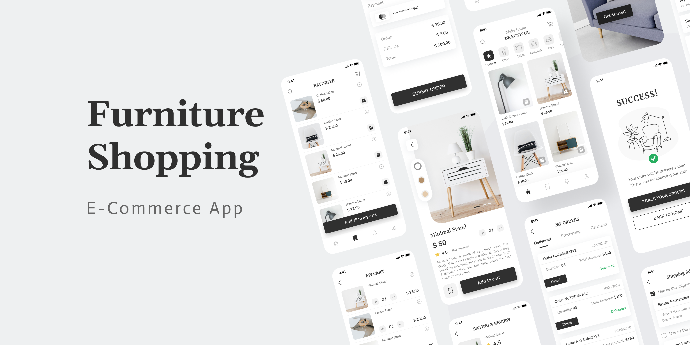

# Flutter Furniture E-Commerce Application

## Overview
This is a Flutter-based furniture e-commerce application designed to provide users with an intuitive and engaging shopping experience. The app allows users to browse, search, and purchase various furniture items, as well as manage their accounts and view order histories.

## Features
- **User Authentication**: Secure sign-up and login functionality.
- **Product Catalog**: Browse through a wide range of furniture items with high-quality images and detailed descriptions.
- **Search and Filters**: Easily find products by category, price, or other attributes.
- **Shopping Cart**: Add items to the cart and proceed to checkout seamlessly.
- **Order History**: View past purchases and order status.
- **User Profiles**: Manage account details and preferences.
- **Responsive Design**: Optimized for both mobile and tablet devices.

## Tech Stack
- **Flutter**: For cross-platform mobile app development.
- **Dart**: Programming language used for Flutter.
- **Firebase**: For backend services including authentication and database storage.
- **Provider**: State management solution for Flutter.

## Overview




## Getting Started

### Prerequisites
- Flutter SDK (latest version)
- Dart SDK (included with Flutter)
- An IDE such as Visual Studio Code or Android Studio
- Firebase account (for backend services)

### Installation
1. Clone the repository:
   ```bash
   git clone https://github.com/yourusername/furniture-ecommerce-app.git
   cd furniture-ecommerce-app